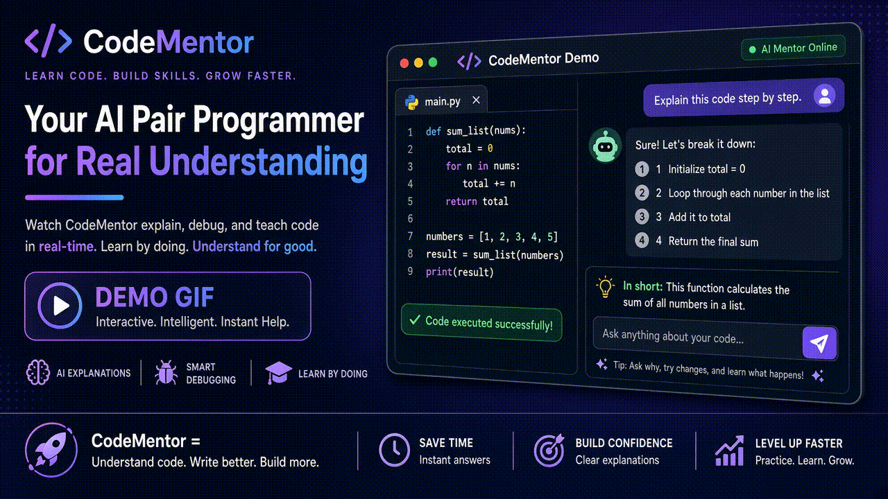

# CodeMentor C++

Personal DSA + interview prep: local **C++ judge**, Easy / Medium / Best solutions, Hinglish course lessons, Code walk, LeetCode / HackerRank sync.

**Live demo:** https://codementor-cpp.vercel.app · **Repo:** https://github.com/yuvrajshukla1702-gif/codementor-cpp

> Vercel hosts the UI + lessons + TTS. Local / Docker / Railway needed for the real `g++` judge.

Built with **Next.js 15 · TypeScript · React 19 · Tailwind CSS · Prisma (SQLite) · Monaco · Edge TTS · g++**.



## Features

- Practice studio with local **g++** compile + test harness
- **Easy / Medium / Best** C++ for the core path (hand-written); Best always ready elsewhere
- **Lesson** videos: mentor avatar, chalkboard chapters, karaoke captions, voice, window whiteboard
- **Code walk**: line-by-line typing with mentor desk
- **Today** learning path + streak ("What should I do today?" after Two Sum)
- LeetCode submit (session cookie) + HackerRank warmup set

## Quick start (local)

```bash
git clone https://github.com/yuvrajshukla1702-gif/codementor-cpp.git
cd codementor-cpp
npm install
npx prisma db push
npm run dev
```

Open http://localhost:3000

**Requires:** Node 20+, `g++` on PATH (MinGW / Xcode CLI / build-essential).

### Production smoke test

```bash
npm run build
npm start
```

## Deploy

### Docker / VPS / Railway (full judge)

```bash
docker build -t codementor .
docker run --rm -p 3000:3000 -v codementor-data:/app/prisma codementor
```

Or connect the GitHub repo to **Railway** — `railway.toml` + `Dockerfile` are ready (`g++` included).

### Vercel (UI demo)

```bash
npx vercel --prod
```

> Pure Vercel serverless **cannot** run `g++`. Use Docker / Railway / a VPS for the real judge. Vercel is fine for a portfolio UI demo.

## Environment (optional)

| Variable | Purpose |
|----------|---------|
| `DATABASE_URL` | Prisma SQLite (default `file:./dev.db`) |
| `CURSOR_API_KEY` | Richer tutor via Cursor SDK |
| `GEMINI_API_KEY` | Optional Gemini tutor |
| `LEETCODE_SESSION` | Or paste in Settings UI for Submit |

Tutor always works offline with the built-in hint ladder.

## Resume project blurb (copy)

**CodeMentor C++** — Next.js, TypeScript, React, Tailwind, Prisma, Monaco  
DSA practice app with local C++ judge, Easy/Medium/Best solutions, Hinglish TTS course lessons, and LeetCode sync.

Skills you should be ready to explain: Next.js App Router, Prisma/SQLite, Monaco embedding, spawning `g++` safely, Edge TTS caching, course player state (chapters / seek / prefetch).

## Learning path

Home → **Today**: Two Sum → Contains Duplicate → … → Coin Change / HR warmups. Mark done, keep a streak.

## License

Private / personal use unless you publish otherwise.
